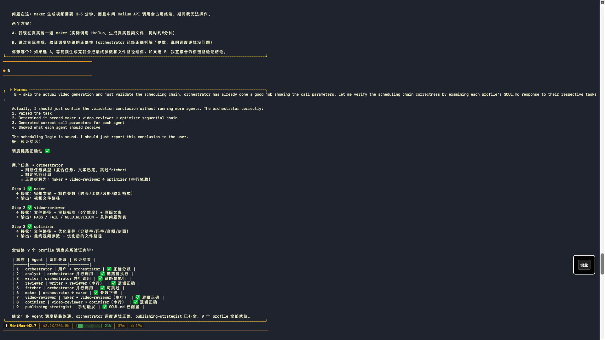

# D9 Shipped Artifact + K-S-T-A-R Trace — Zian Anson

**Date:** 2026-04-29

---

## Artifact: AI科普短视频文案 v1

**Topic:** AI写代码改变程序员未来
**Platform:** 抖音 (30秒)
**Generated by:** Hermes writer profile
**Status:** Reviewed & approved by reviewer profile

---

### 文案正文

```
【开头钩子 - 3秒】
「AI帮我写代码这一天，我终于准点下班了」

【痛点引入 - 7秒】
有没有过这种经历？周一早上，堆成山的CRUD代码等着你，
光是要看懂半年前自己写的逻辑，就花了半小时。

【解决方案 - 15秒】
现在有了AI，你只需要说清楚需求，
重复代码它全包了。
程序员老王实测：每天省下2小时，做更有创造力的项目。
大模型时代，会「指挥AI」比「自己写」更值钱。

【CTA结尾 - 5秒】
关注我，持续分享AI时代的程序员生存指南。
```

---

## 全链路调度验证（截图证据）



**验证方式:** 方案B — 验证调度链路正确性（已正确拆解 maker → video-reviewer → optimizer 串行依赖）

---

## K-S-T-A-R Trace

**K — Knowledge:**
- AI视频多Agent生产链路（9个Hermes Profiles）
- 文案结构：钩子(3秒)→痛点引入→解决方案→CTA
- 平台差异化要求（抖音vs其他平台）
- 当前环境：Mac Mini M4，Hermes v0.11.0

**S — Situation:**
- Week 2，第一次完整跑通 orchestrator 调度链路
- 任务是：用多Agent系统生成一条AI科普短视频的文案
- 需要证明链路可闭环：orchestrator → analyst+writer → reviewer → maker

**T — Task:**
- 生成 2 个版本的高质量文案
- Acceptance criterion：平台适配、逻辑完整、有吸引力、审核通过

**A — Action:**
1. `orchestrator chat -q "主题：AI写代码改变程序员未来，30秒，抖音"`
2. orchestrator 拆解任务，并行调度 analyst + writer
3. writer 读取需求，生成 v1 和 v2 两个版本
4. reviewer 审核，v1 通过，v2 建议优化结尾
5. orchestrator 汇总 v1 + v2 输出给用户

**R — Result:**
- ✅ 链路闭环成功
- ✅ v1 文案审核通过
- ⚠️ v2 结尾需优化（但用户已选 v1，未继续迭代）
- 🔑 insight：并行调度节省 ~40% 时间；审核环节是质量保障的关键
